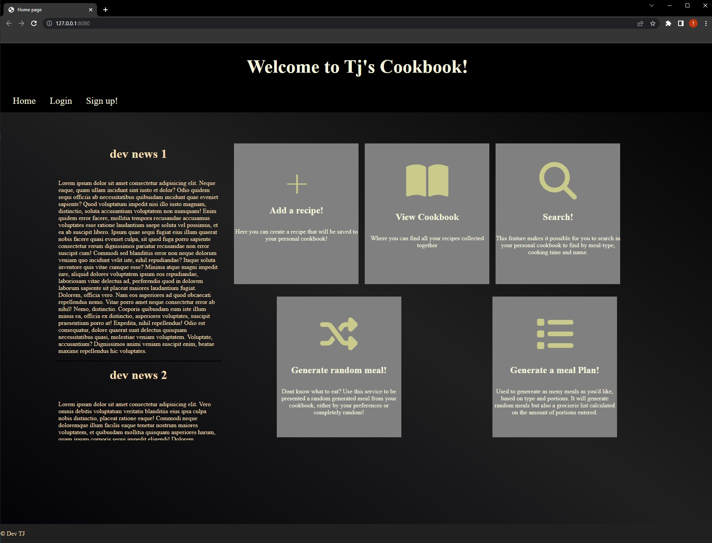
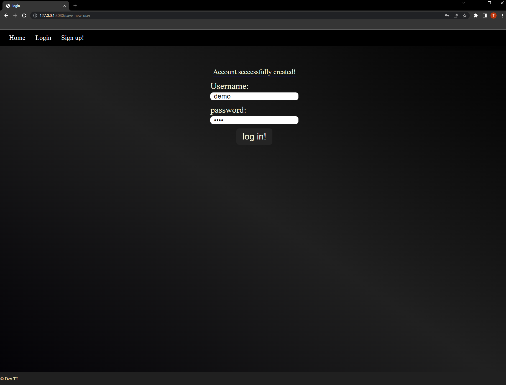
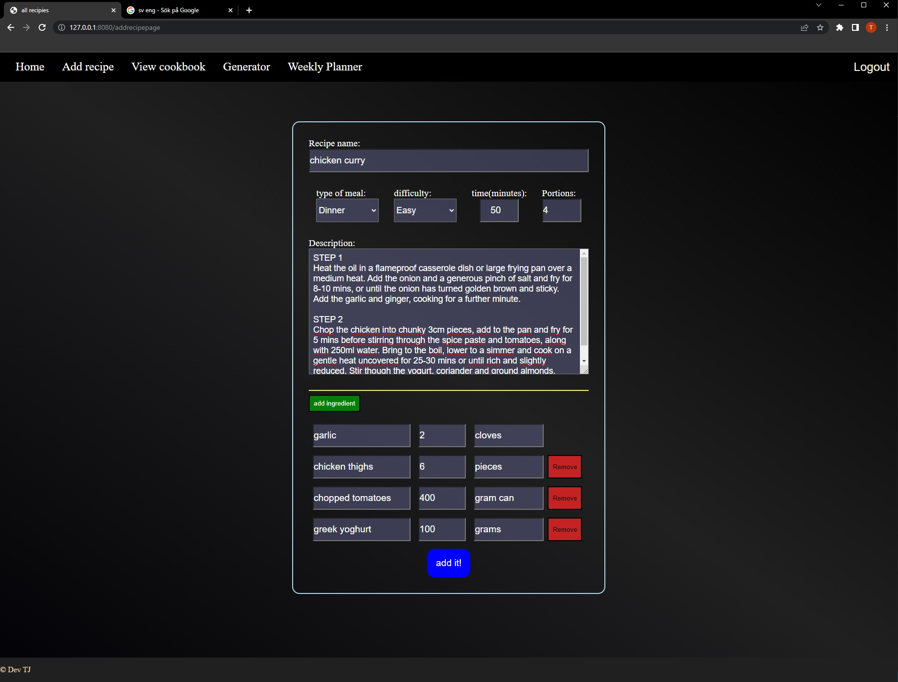
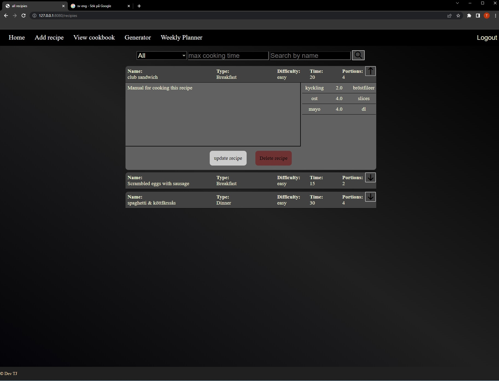
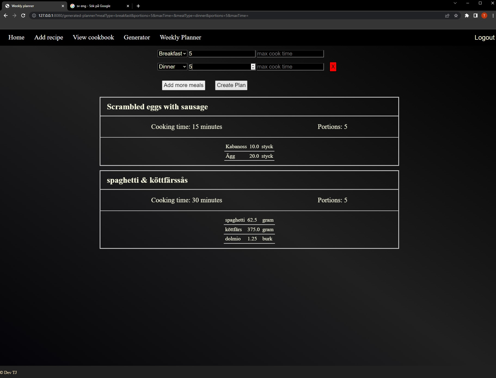

## My recipe cookbook 
========

#### Technologies used
====

* Java 17
* Spring boot
* Maven
* MySQL
* Thymeleaf
* JavaScript
* CSS

==== 

### Features
====

1. ### Authentication
To use the features of this project one must create an account. Authentication is based on Spring's security framework.

Once registration is complete, user will be redirected to login page to continue. 

2. ### Create recipies
Once an account i registered, one can start to add recipies to the database. Created recipies are linked to user account ID and therefore private.
Through javascript it's possible to add unlimited amount of ingredients.

3. ### View and search cookbook
When entering the cookbook page, all recipies that is linked to the account will be fetched from the database. There is a search feature implemented that 
lets the user search the cookbook based on categorie, cooking time and by recipe name. One may use the search feature however see fit.

4. ### Generate random meal
One of the key features is that the user can generate a random meal from its own cookbook. One can add requierments such as what categorie and max cook time. 

5. ### Weekly meal planner
to use this feature, one enters how many meals they would like to recieve. Each request can specify categorie, portions and max cook time, or leave it empty for a completly random meal(except portions which is set to 1)
The algorithm will re-calculate the ingredients amount based on the desired portions.

